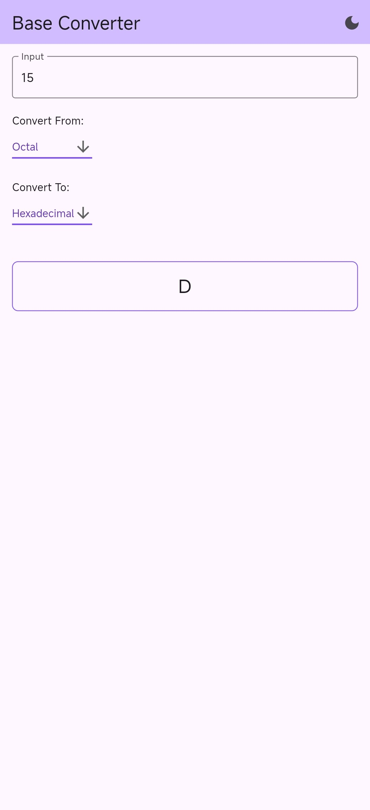
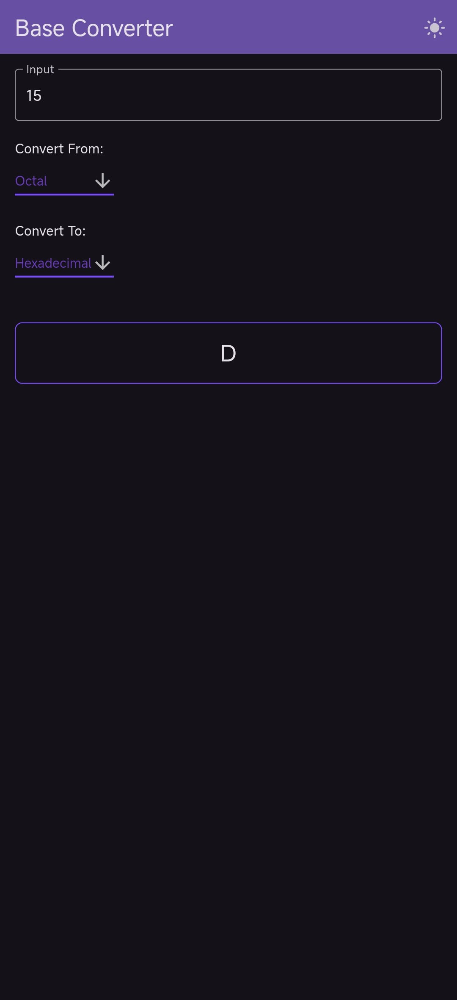
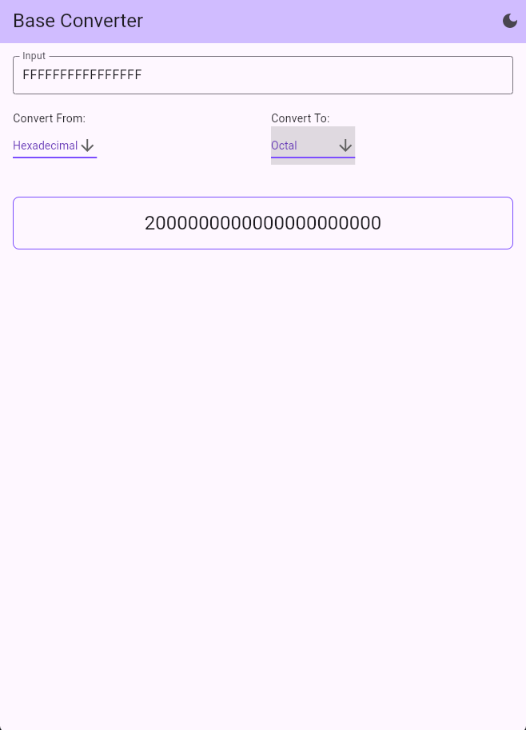
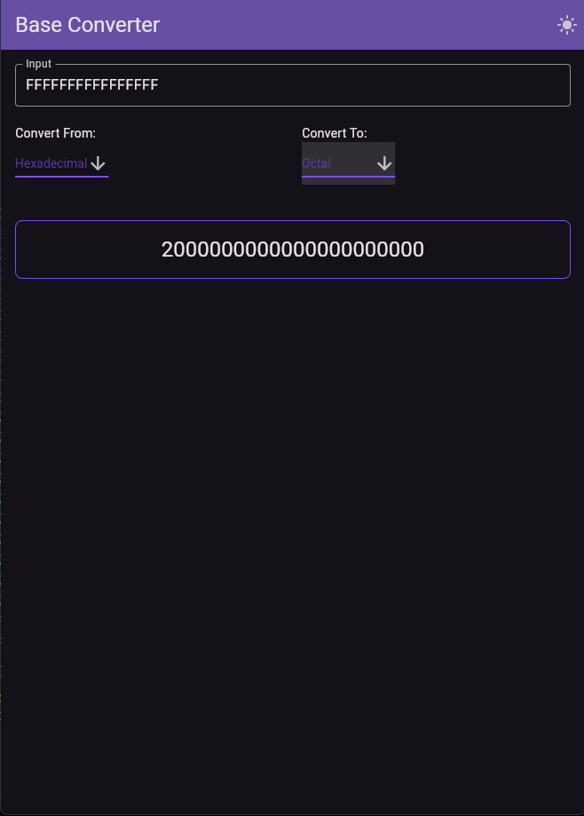
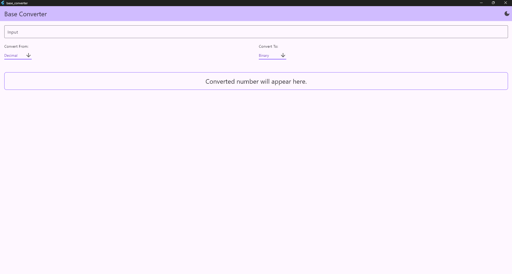
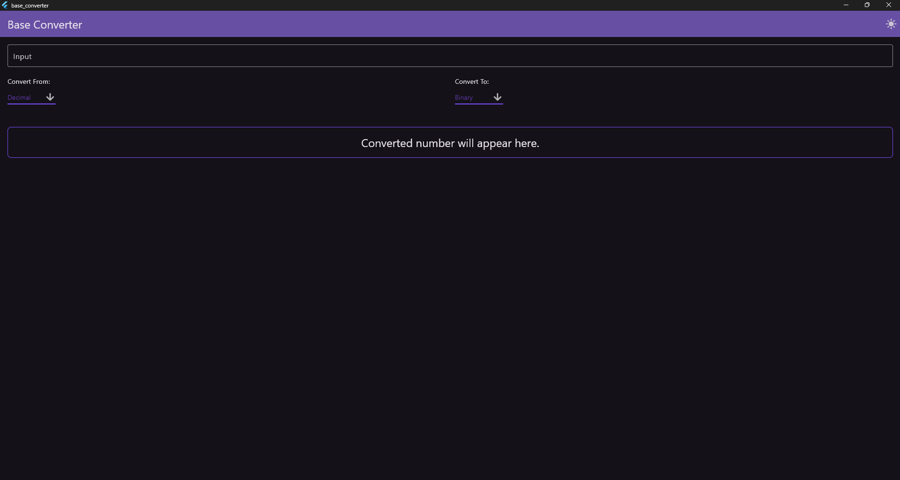

# Base Converter App

Base Converter App is a Flutter application that allows users to convert numbers between different bases: Decimal, Binary, Hexadecimal, and Octal. It features a clean, professional UI, supports dark and light themes, and is responsive across various devices, including mobile phones, tablets, and desktops.

## Features

- **Base Conversion**: Convert numbers between Decimal, Binary, Hexadecimal, and Octal.
- **Responsive Design**: Optimized for different screen sizes, including mobile, tablet, and desktop.
- **Dark/Light Theme**: Toggle between dark and light modes.
- **User-Friendly Interface**: Intuitive and clean UI for a seamless user experience.

## Screenshots

### Mobile View

| Light Theme | Dark Theme |
|-------------|------------|
|  |  |

### Tablet View

| Light Theme | Dark Theme |
|-------------|------------|
|||

### Desktop View

| Light Theme |
|-------------|

| Dark Theme |
||

## Getting Started

Follow these instructions to get a copy of the project up and running on your local machine for development and testing purposes.

### Prerequisites

- [Flutter SDK](https://flutter.dev/docs/get-started/install)
- [Android Studio](https://developer.android.com/studio) or [Visual Studio Code](https://code.visualstudio.com/) with Flutter and Dart plugins

### Installation

1. Clone the repository:

   ```bash
   git clone https://github.com/your-username/base_converter_app.git
   cd base_converter_app
   ```

2. Install dependencies:

   ```bash
   flutter pub get
   ```

3. Run the app:

   ```bash
   flutter run
   ```

## Usage

1. Enter the number you want to convert in the input field.
2. Select the base of the input number from the "Convert From" dropdown.
3. Select the base you want to convert the number to from the "Convert To" dropdown.
4. The converted number will be displayed below the dropdowns.

## File Structure

```plaintext
base_converter_app/
├── lib/
│   ├── models/
│   │   ├── binary.dart
│   │   ├── decimal.dart
│   │   ├── hexadecimal.dart
│   │   ├── octal.dart
│   ├── themes/
│   │   ├── theme_notifier.dart
|   |   ├── theme.dart
|   ├── widgets/
│   |   ├── converter_widget.dart
│   ├── main.dart
└── pubspec.yaml
```

## Models

### `binary.dart`

Functions to convert binary numbers to other bases and vice versa.

### `decimal.dart`

Functions to convert decimal numbers to other bases and vice versa.

### `hexadecimal.dart`

Functions to convert hexadecimal numbers to other bases and vice versa.

### `octal.dart`

Functions to convert octal numbers to other bases and vice versa.

## Themes

### `theme_notifier.dart`

Notifier class to toggle between dark and light themes.

## Widgets

### `converter_widget.dart`

Main widget that contains the UI and logic for base conversion.

## Contributing

Contributions are welcome! Please fork the repository and use a feature branch. Pull requests are warmly welcome.


## Acknowledgments

- [Flutter](https://flutter.dev/).
- [Provider](https://pub.dev/packages/provider).
